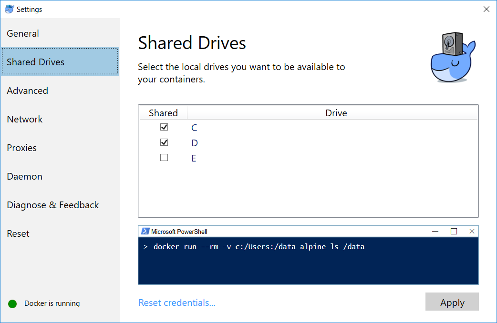

# ROS_Docker
Installieren Sie sich Docker auf Ihrem Rechner. 

## Datenzugriff erlaufen (WINDOWS)
Öffnen Sie die Docker-Einstellungen und erlauben Sie den Zugriff auf die Daten



## Build Docker (OPTIONIAL)
Falls Sie das Docker-Image selber bauen wollen führen Sie folgende Schritte aus, anderenfalls wird ein bereits gebautes Docker-Images vom Repository downgeloaded.
### Build Docker (MAC + LINUX)
Öffnen Sie eine Terminal im Repository und führen Sie das build_docker.sh Skript aus:
```bash
sh build_docker.sh
```

### Build Docker (WINDOWS)
Öffnen Sie eine Powershell im Repository und führen Sie das build_docker.bat Skript aus:
```
.\build_docker.bat
```

## Starten des Dockers
Folgende Skripte können mit dem selbst gebauten Docker-Image oder mit dem Docker-Image aus dem Repository (**wird automatisch beim ersten Starten heruntergeladen (ca. 3GB)**) ausgeführt werden.

### Starten des Dockers (MAC + LINUX)

Führen Sie das start_docker.sh Skript aus:
```bash
sh start_docker.sh
```

Sie können sich per VNC auf den Docker verbinden indem Sie folgenden Link aufrufen:
http://127.0.0.1:6080

Alternativ können Sie sich mit einem VNC Viewer mit folgender Adresse verbinden:
localhost:5900

Um eine Konsole ohne VNC des Docker-Images zu öffnen muss der Docker laufen.
```
sh open_shell.sh
```
##
### Starten des Dockers (Windows)

Führen Sie das start_docker.bat Skript aus:
```
./start_docker.bat
```

Sie können sich per VNC auf den Docker verbinden indem Sie folgenden Link aufrufen:
http://127.0.0.1:6080

Alternativ können Sie sich mit einem VNC Viewer mit folgender Adresse verbinden:
localhost:5900

Um eine Konsole ohne VNC des Docker-Images zu öffnen muss der Docker laufen.
```
./open_shell.bat
```


